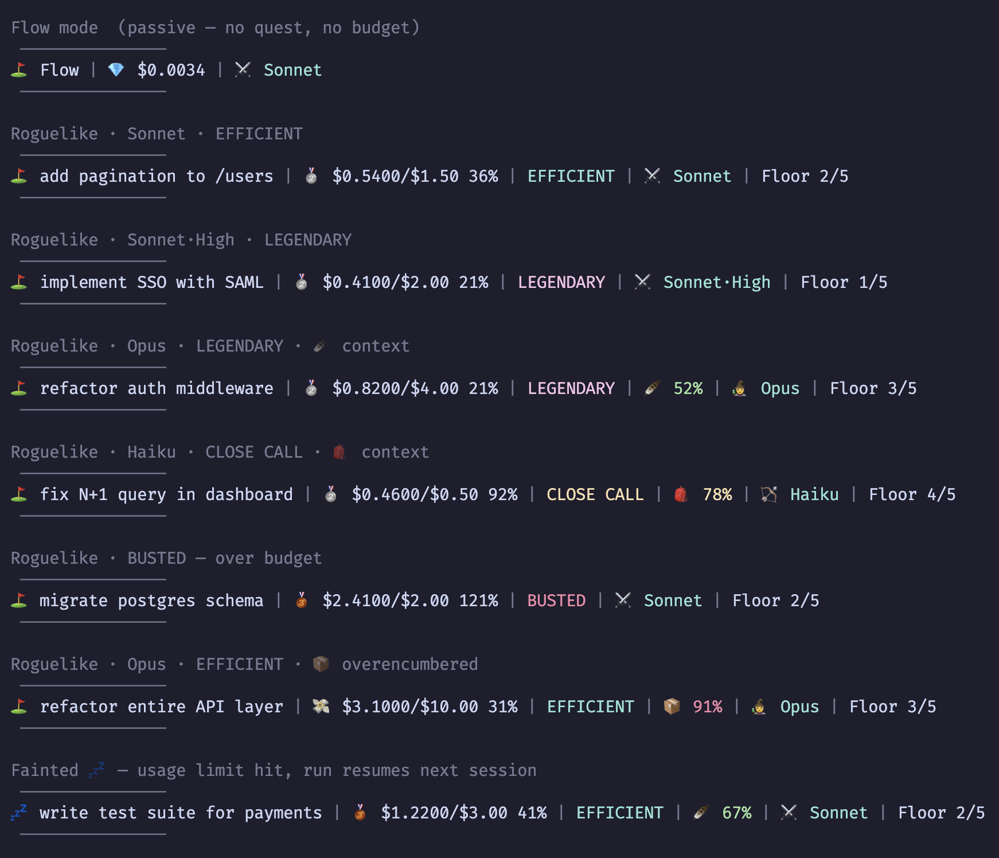

# ⛳ TokenGolf

> Flow mode tracks you. Roguelike mode trains you.

Turn Claude Code token efficiency into a game. Declare a quest, commit to a budget, pick a character class. Work normally. At the end, get a score based on how efficiently you used your budget.

**Better prompting → fewer tokens → higher score.**

**[tokengolf.dev](https://josheche.github.io/tokengolf/)** · [npm](https://www.npmjs.com/package/tokengolf) · [GitHub](https://github.com/josheche/tokengolf)

---

<!-- SCREENSHOT: tokengolf start wizard — quest/class/effort/budget selection -->

---

## Why "TokenGolf"?

[Code golf](https://en.wikipedia.org/wiki/Code_golf) is the engineering practice of solving a problem in as few characters (or lines, or bytes) as possible. The constraint isn't the point — the *discipline the constraint creates* is the point. Writing the shortest possible solution forces you to understand the problem deeply and use your tools precisely.

Token golf is the same idea applied to AI sessions. Your budget is par. Every unnecessary prompt, every redundant context dump, every "can you also..." tacked onto a request is a stroke over par. The game doesn't literally resemble golf — it borrows the concept: **optimize under constraint, measure your score, improve your game.**

---

## Two Modes

### ⛳ Flow Mode
Just work. TokenGolf auto-creates a tracking session when you open Claude Code. `/exit` the session and the scorecard appears automatically. No pre-configuration required.

### ☠️ Roguelike Mode
Pre-commit before you start. Declare a quest, pick a class and effort level, set a budget. Go over budget = permadeath — the run is logged as a death. The deliberate pressure trains better prompting habits, which makes your Flow sessions cheaper over time.

---

## Install

```bash
npm install -g tokengolf
tokengolf install
```

`tokengolf install` patches `~/.claude/settings.json` with the hooks that power live tracking, the HUD, and the auto scorecard.

---

## Commands

```bash
tokengolf start       # declare quest + class + effort + budget, begin a run
tokengolf status      # live run status
tokengolf win         # shipped it ✓ (auto-detects cost from transcripts)
tokengolf bust        # manual permadeath override
tokengolf scorecard   # last run scorecard
tokengolf stats       # career dashboard
tokengolf install     # patch ~/.claude/settings.json with hooks
tokengolf demo        # show all HUD states (for screenshots)
```

---

## Character Classes & Effort

| Class | Model | Effort | Feel |
|-------|-------|--------|------|
| 🏹 Rogue | Haiku | — *(skips effort step)* | Glass cannon. Prompt precisely or die. |
| ⚔️ Fighter | Sonnet | Low / **Medium** / High | Balanced. The default run. |
| 🧙 Warlock | Opus | Low / **Medium** / High / Max | Powerful but costly. |
| ⚜️ Paladin | Opus (plan mode) | Low / **Medium** / High / Max | Strategic planner. Thinks before acting. |
| ⚡ Warlock·Fast | Opus + fast mode | any | 2× cost. Maximum danger mode. |

`max` effort is Opus-only — the API returns an error if used on other models. Fast mode is toggled mid-session with `/fast` in Claude Code and is auto-detected by TokenGolf.

---

## Budget Presets (Model-Calibrated)

The wizard shows different amounts depending on your class — same relative difficulty, different absolute cost. Anchored to the ~$0.75/task Sonnet average from Anthropic's $6/day Claude Code benchmark.

| Tier | Haiku 🏹 | Sonnet ⚔️ | Opus 🧙 | Feel |
|------|---------|---------|--------|------|
| 💎 Diamond | $0.15 | $0.50 | $2.50 | Surgical micro-task |
| 🥇 Gold | $0.40 | $1.50 | $7.50 | Focused small task |
| 🥈 Silver | $1.00 | $4.00 | $20.00 | Medium task |
| 🥉 Bronze | $2.50 | $10.00 | $50.00 | Heavy / complex |
| ✏️ Custom | any | any | any | Set your own bust threshold |

These are **bust thresholds** — your commitment. Efficiency tiers derive as percentages of whatever you commit to.

---

## Scoring

**Efficiency rating** (roguelike mode — % of your budget used):

| 🌟 LEGENDARY | ⚡ EFFICIENT | ✓ SOLID | 😅 CLOSE CALL | 💀 BUSTED |
|---|---|---|---|---|
| < 25% | < 50% | < 75% | < 100% | > 100% |

**Spend tier** (absolute cost, shown on every scorecard):

| 💎 | 🥇 | 🥈 | 🥉 | 💸 |
|---|---|---|---|---|
| < $0.10 | < $0.30 | < $1.00 | < $3.00 | > $3.00 |

---

## Ultrathink

Write `ultrathink` anywhere in your prompt to trigger extended thinking mode. It's not a slash command — just say it in natural language:

> *"ultrathink: is this the right architecture before I write anything?"*
> *"can you ultrathink through the tradeoffs here?"*

Extended thinking tokens are billed at full output rate. A single ultrathink on Sonnet can cost $0.50–2.00 depending on problem depth. TokenGolf detects thinking blocks from your session transcripts and tracks invocations and estimated thinking tokens — both show on your scorecard.

**The skill is knowing when to ultrathink.** One expensive deep-think that prevents five wrong turns is efficient. Ultrathinking every prompt when you're at 80% budget is hubris.

---

## The Meta Loop

The dungeon crawl framing maps directly to real session behaviors:

- **Overencumbered** = context bloat slowing you down
- **Made Camp** = hit usage limits, came back next session
- **Ghost Run** = surgical context management before the boss
- **Hubris** = reached for ultrathink on a tight budget and paid for it
- **Silent Run** = solved it with pure prompting discipline, no extended thinking needed
- **Lone Wolf** = didn't spawn a single subagent; held the whole problem in one context
- **Agentic** = gave Claude the wheel and it ran with it — 3+ turns per prompt

Roguelike mode surfaces these patterns explicitly. Flow mode lets them compound over time. The meta loop: **roguelike practice makes Flow sessions better. Better Flow = lower daily spend = better scores without even trying.**

---

## Achievements

**Class**
- 💎 Diamond — Haiku under $0.10 total spend
- 🥇 Gold — Completed with Haiku
- 🥈 Silver — Completed with Sonnet
- 🥉 Bronze — Completed with Opus

**Efficiency**
- 🎯 Sniper — Under 25% of budget used
- ⚡ Efficient — Under 50% of budget used
- 🪙 Penny Pincher — Total spend under $0.10
- 🪙 Cheap Shots — Under $0.01 per prompt (≥3 prompts)
- 🍷 Expensive Taste — Over $0.50 per prompt (≥3 prompts)

**Prompting skill**
- 🎯 One Shot — Completed in a single prompt
- 💬 Conversationalist — 20+ prompts in one run
- 🤐 Terse — ≤3 prompts, ≥10 tool calls
- 🪑 Backseat Driver — 15+ prompts but <1 tool call per prompt
- 🏗️ High Leverage — 5+ tool calls per prompt (≥2 prompts)

**Tool mastery**
- 👁️ Read Only — Won with no Edit or Write calls
- ✏️ Editor — 10+ Edit calls
- 🐚 Bash Warrior — 10+ Bash calls comprising ≥50% of tools
- 🔍 Scout — ≥60% of tool calls were Reads (≥5 total)
- 🔪 Surgeon — 1–3 Edit calls, completed under budget
- 🧰 Toolbox — 5+ distinct tools used

**Effort**
- 🎯 Speedrunner — Low effort, completed under budget
- 💪 Tryhard — High/max effort, LEGENDARY efficiency
- 👑 Archmagus — Opus at max effort, completed

**Fast mode**
- ⚡ Lightning Run — Opus fast mode, completed under budget
- 🎰 Daredevil — Opus fast mode, LEGENDARY efficiency

**Time**
- ⏱️ Speedrun — Completed in under 5 minutes
- 🏃 Marathon — Session over 60 minutes
- 🫠 Endurance — Session over 3 hours

**Ultrathink**
- 🔮 Spell Cast — Used extended thinking during the run
- 🧠 Calculated Risk — Ultrathink + LEGENDARY efficiency
- 🌀 Deep Thinker — 3+ ultrathink invocations, completed under budget
- 🤫 Silent Run — No extended thinking, SOLID or better *(think without thinking)*
- 🤦 Hubris — Used ultrathink, busted anyway *(death achievement)*

**Multi-model**
- 🏹 Frugal — Haiku handled ≥50% of session cost
- 🎲 Rogue Run — Haiku handled ≥75% of session cost

**Rest & recovery**
- ⚡ No Rest for the Wicked — Completed in one session
- 🏕️ Made Camp — Completed across multiple sessions
- 💪 Came Back — Fainted (hit usage limits) and finished anyway

**Context management (gear)**
- 📦 Overencumbered — Context auto-compacted during run
- 🎒 Traveling Light — Manual compact at ≤50% context
- 🪶 Ultralight — Manual compact at ≤40% context
- 🥷 Ghost Run — Manual compact at ≤30% context

**Tool reliability** *(requires PostToolUseFailure hook)*
- ✅ Clean Run — Zero failed tool calls (≥5 total)
- 🐂 Stubborn — 10+ failed tool calls, still won

**Subagents** *(requires SubagentStart hook)*
- 🐺 Lone Wolf — Completed with no subagents spawned
- 📡 Summoner — 5+ subagents spawned
- 🪖 Army of One — 10+ subagents, under 50% budget used

**Turn discipline** *(requires Stop hook)*
- 🤖 Agentic — 3+ Claude turns per user prompt
- 🐕 Obedient — Exactly one turn per prompt (≥3 prompts)

**Death marks** *(fire on bust, not win)*
- 💥 Blowout — Spent 2× your budget
- 😭 So Close — Died within 10% of budget
- 🔨 Tool Happy — Died with 30+ tool calls
- 🪦 Silent Death — Died with ≤2 prompts
- 🤡 Fumble — Died with 5+ failed tool calls

---

## Live HUD

After `tokengolf install`, a status line appears in every Claude Code session:

- **tier emoji** (💎🥇🥈🥉💸) updates live as cost accumulates
- **🪶 green** at 50–74% context — traveling light
- **🎒 yellow** at 75–89% context — getting heavy
- **📦 red** at 90%+ context — overencumbered, consider compacting
- **💤** instead of ⛳ if the previous session fainted (hit usage limits)
- Roguelike runs show floor progress; Flow runs omit budget/efficiency

Run `tokengolf demo` to see all HUD states rendered in your terminal:



---

## Auto Scorecard

When you `/exit` a Claude Code session, the scorecard appears automatically:

```
╔════════════════════════════════════════════════════════════════════╗
║  🏆  SESSION COMPLETE                                              ║
║  implement pagination for /users                                   ║
╠════════════════════════════════════════════════════════════════════╣
║  $0.18/$0.50  36%  ⚡ EFFICIENT  ⚔️ Sonnet·High  🥇 Gold           ║
╠════════════════════════════════════════════════════════════════════╣
║  🔮 1 ultrathink invocation  ~8.4K thinking tokens                ║
╠════════════════════════════════════════════════════════════════════╣
║  🥈 silver_sonnet  🎯 sniper  🔮 spell_cast  🧮 calculated_risk    ║
╠════════════════════════════════════════════════════════════════════╣
║  tokengolf scorecard  ·  tokengolf start  ·  tokengolf stats      ║
╚════════════════════════════════════════════════════════════════════╝
```

<!-- SCREENSHOT: Auto-displayed scorecard after /exit in Claude Code terminal -->

---

## Hooks

Nine hooks installed via `tokengolf install`:

| Hook | When | What it does |
|------|------|-------------|
| `SessionStart` | Session opens | Injects quest/budget/floor into Claude's context. Auto-creates Flow run if none active. Increments session count for multi-session runs. |
| `PostToolUse` | After every tool | Tracks tool usage by type. Fires budget warning at 80%. |
| `PostToolUseFailure` | After a tool error | Increments `failedToolCalls` — powers Clean Run, Stubborn, Fumble. |
| `UserPromptSubmit` | Each prompt | Counts prompts. Injects halfway nudge at 50% budget. |
| `PreCompact` | Before compaction | Records manual vs auto compact + context % — powers gear achievements. |
| `SessionEnd` | Session closes | Scans transcripts for cost + ultrathink blocks, saves run, displays ANSI scorecard. Detects Fainted if session ended unexpectedly (usage limit hit). |
| `SubagentStart` | Subagent spawned | Increments `subagentSpawns` — powers Lone Wolf, Summoner, Army of One. |
| `Stop` | Claude finishes a turn | Increments `turnCount` — powers Agentic, Obedient. |
| `StatusLine` | Continuously | Live HUD with cost, tier, efficiency, context %, model class. |

---

## State

All data lives in `~/.tokengolf/`:
- `current-run.json` — active run
- `runs.json` — completed run history

No database, no native deps, no compilation.
